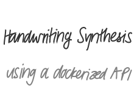

# Handwriting Synthesis API

Implementation of the handwriting synthesis experiements in the paper <a href="https://arxiv.org/abs/1308.0850">Generating Sequences with Recurrent Neural Networks</a> by Alex Graves.

This repository provides a Dockerized implementation of the handwriting synthesis models, making it easy to use and integrate into applications.

## Getting Started

To get started, simply run the Docker container using the following command:
```bash
docker run -p 8080:8080 ghcr.io/commandblock123/handwriting-synthesis:v1.0.0
```
This will start the container and make the API available at http://localhost:8080.

## Usage

For detailed information on how to use the Handwriting Synthesis API, please refer to the [API Documentation](API_Documentation.md).
You can also see an example of an API request in the [example_api_request.py](example_api_request.py) file.

## Demonstrations


